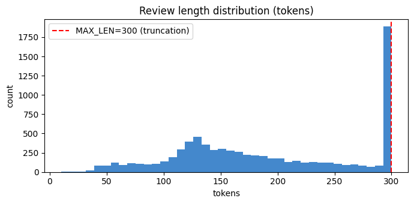
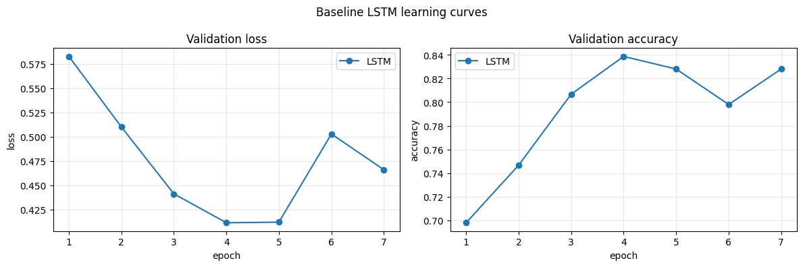
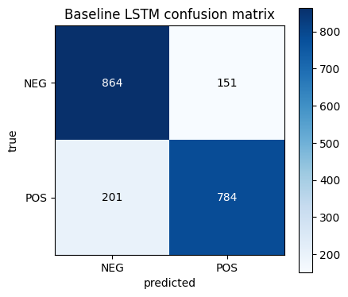
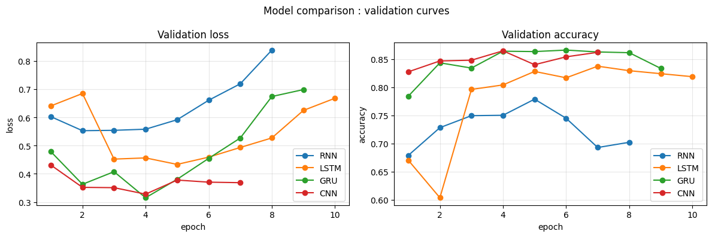
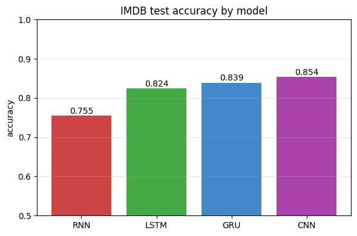
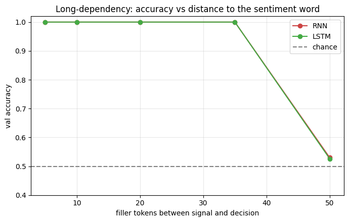
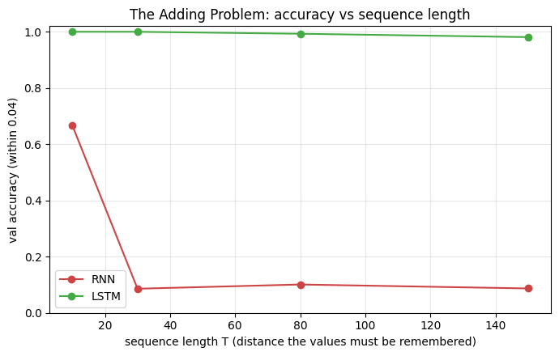
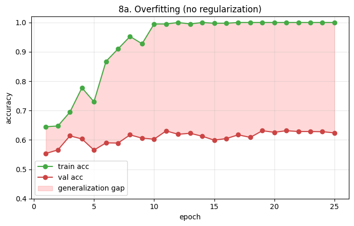
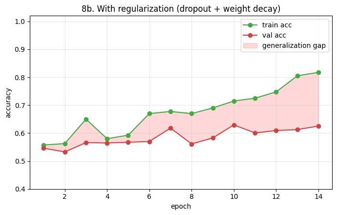
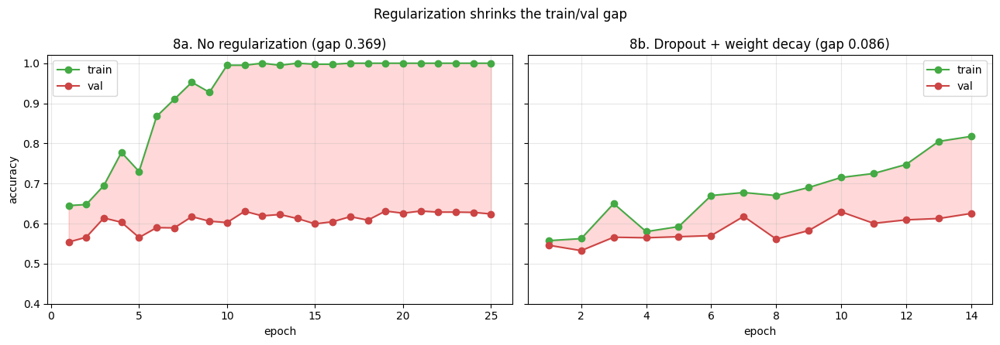

# Experiment Report: LSTM for Sentiment Analysis and the Long-Range Memory Problem

## Overview

This report documents a full experimental study of the Long Short-Term Memory network (LSTM) applied to sentiment classification on the IMDB movie-review dataset, alongside a set of controlled experiments comparing recurrent and convolutional architectures and probing the specific problems of long-range memory, overfitting, and regularization.

The study had four goals: establish a working LSTM baseline on real text, compare it fairly against a vanilla RNN, a GRU, and a 1D-CNN, demonstrate the long-range memory advantage that motivated the LSTM in the first place, and study overfitting and its mitigation through regularization. Two of the experiments required a second design iteration before they revealed their intended effect, and both iterations are documented here because the debugging process is itself part of the result.

---

## 1. Dataset and Preprocessing

The data is the IMDB movie-review corpus, a binary sentiment classification task with positive and negative labels. A subset of eight thousand training reviews and two thousand test reviews was used to keep training time practical, with fifteen hundred reviews held out from the training set for validation.

The full text preprocessing pipeline was built explicitly rather than relying on a high-level text library. The steps were tokenization (lowercasing and splitting into word tokens with a regular expression), vocabulary construction (the twenty thousand most frequent training words, with index 0 reserved for the padding token and index 1 for unknown words), numericalization (mapping each review to a list of integer ids), and padding or truncation to a fixed length of three hundred tokens.

The review-length distribution shows why padding and truncation are necessary. Most reviews cluster around one hundred thirty tokens, but the distribution has a long tail, and there is a visible spike at the three-hundred-token truncation limit representing all reviews that were longer than the cutoff.

Because reviews vary widely in length, a fixed length with right-padding is required to batch them together, and this padding choice turned out to have important consequences for the recurrent models, discussed in Section 3.



---

## 2. Pretrained Embeddings (GloVe)

Rather than learning word vectors from scratch on a relatively small corpus, pretrained GloVe embeddings (one hundred dimensions, trained on Wikipedia and Gigaword) were loaded into the embedding layer. Coverage was high: 18,956 of the 20,000 vocabulary words, or ninety-five percent, were found in GloVe, with the remaining rare words keeping a small random initialization. The padding row was kept at zero.

Pretrained embeddings serve two purposes. They give a substantial accuracy improvement because the model starts with meaningful word representations instead of random ones, and they act as a form of regularization, since far fewer parameters need to be fit from the limited training data.

---

## 3. A Preprocessing Bug and Its Fix: Padding and the Final Hidden State

The first attempt at the model comparison produced a striking failure: the RNN, LSTM, and GRU all sat at approximately fifty percent accuracy, which is chance for a binary task, while the CNN worked normally at around eighty percent.

When three different architectures fail in exactly the same way, the cause is almost never the architecture; it is something shared upstream. The shared component here was how the recurrent models read their output. Each read the hidden state at the very last timestep of the padded sequence. Because reviews were padded on the right to three hundred tokens and most were far shorter, the last timestep for a typical review sat deep in a long run of padding. The recurrent network built up a useful representation while reading the real words, then had to carry that signal across roughly one hundred seventy padding steps before the output was read, by which point the signal had decayed. The CNN was immune because it max-pools over all positions and simply selects the strongest features wherever they occur, ignoring the padding tail.

The fix was to use packed sequences, which tell the recurrent network to skip padding entirely and expose each review's true final hidden state at its last real word. After this change the recurrent models recovered and produced sensible accuracies. This is the correct and standard way to apply a final-hidden-state recurrent model to variable-length padded text.

---

## 4. Baseline LSTM

The baseline was a single-layer LSTM with a hidden size of one hundred twenty-eight, GloVe embeddings, light dropout of 0.3, gradient clipping, and early stopping on validation accuracy. It has approximately 2.1 million trainable parameters.

Training showed clean and rapid learning. Validation accuracy climbed from 0.698 at epoch 1 to a peak of 0.839 at epoch 4. After epoch 4 the model began to overfit: training accuracy continued rising toward 0.986 while validation accuracy stopped improving and validation loss began to climb. Early stopping halted training at epoch 7 and restored the best checkpoint from epoch 4. The final test accuracy was 0.824.

The validation-loss and validation-accuracy curves make the early-stopping decision visible. Validation loss reaches its minimum around epoch 4, then turns upward, which is the classic sign that the model has begun to memorize rather than generalize. Restoring the epoch-4 weights captures the model at its best generalization point.



### Qualitative predictions

Inspecting individual predictions on test reviews confirmed the model behaves sensibly. It correctly and confidently classified clear positive reviews (probabilities in the 0.91 to 0.95 range) and clear negative reviews. The one error observed in the sample was instructive: a negative review that opens with heavily sarcastic praise ("Oh boy! It was just a dream! What a great idea!") was confidently misclassified as positive. Sarcasm and negation are exactly the cases where surface-level positive words mislead a sentiment model, which points to a genuine limitation rather than a random mistake.

### Confusion matrix

On the full test set the confusion matrix showed 864 true negatives, 784 true positives, 151 false positives, and 201 false negatives. The model makes more errors on positive reviews (201 missed) than on negative reviews (151 missed), a mild bias toward predicting negative. This is consistent with the sarcasm observation: positive reviews more often use complex or ironic phrasing that the model reads as negative.



---

## 5. Model Comparison: LSTM vs RNN vs GRU vs CNN

All four models were trained with the same embeddings, dropout, and training budget, so the comparison is fair. The test results were:

| Model | Test accuracy | Best validation | Best epoch | Parameters | Train time |
|-------|---------------|------------------|------------|------------|------------|
| RNN   | 0.755 | 0.779 | 5 | 2,029,698 | 19.6s |
| LSTM  | 0.824 | 0.837 | 7 | 2,118,018 | 24.6s |
| GRU   | 0.839 | 0.866 | 6 | 2,088,578 | 21.1s |
| CNN   | 0.854 | 0.865 | 4 | 2,120,902 | 11.2s |

The ordering is the textbook result: RNN at 0.755 is the weakest, the LSTM improves substantially to 0.824, the GRU matches or slightly exceeds the LSTM at 0.839 while using fewer parameters, and the CNN leads at 0.854.

Two observations. First, the roughly seven-point gap from RNN to LSTM is the gating mechanism earning its value: on the same task with the same budget, the only difference is the LSTM's ability to hold information across the review, and the RNN's weaker memory shows in the validation curves, where its loss turns upward earliest and its accuracy peaks lowest. Second, the CNN leading is honest and expected rather than a flaw. Sentiment classification is largely a matter of detecting local phrases such as "waste of time" or "absolutely loved," which is exactly what a multi-kernel convolutional model with max-pooling does well, and it does not require long-range memory. This task therefore does not showcase the LSTM's core strength; the experiment that does is in Section 6.

The CNN was also more than twice as fast to train, reflecting that it can process all positions in parallel while the recurrent models must step through the sequence in order.





---

## 6. The Long-Range Memory Advantage

This is the experiment designed to show what the LSTM does that a plain RNN cannot: remember information across a long span.

### First attempt and why it failed

The first design placed a strong sentiment cue word at the start of a sequence, followed by a variable number of neutral filler tokens, and asked the model to recall the cue's sentiment. As the filler length grew, the intention was to see the RNN forget the cue while the LSTM held it.

The result did not separate the two models:

```
filler T=  5 | RNN acc 1.000 | LSTM acc 1.000
filler T= 10 | RNN acc 1.000 | LSTM acc 1.000
filler T= 20 | RNN acc 1.000 | LSTM acc 1.000
filler T= 35 | RNN acc 1.000 | LSTM acc 1.000
filler T= 50 | RNN acc 0.530 | LSTM acc 0.526
```

Both models held perfectly up to a filler length of thirty-five, then both collapsed together to near-chance at fifty. They never diverged. The reason is that the task was too easy in the wrong way: a single distinct cue token with repetitive filler is trivial for both architectures until the sequence becomes long enough that the gradient signal to the cue dies for both at once, producing a shared cliff rather than a gradual separation. There was no length regime where the RNN was stressed but the LSTM coped, which is precisely the regime the experiment needed to expose.



### The fix: the adding problem

The task was replaced with the adding problem from the original 1997 LSTM paper, which is purpose-built to separate the two architectures. Each sequence has two channels per timestep: a random value and a marker that is set at exactly two positions. The target is the sum of the two values whose markers are set. To solve it the model must locate two marked positions that can be far apart, remember both real-valued numbers, and add them, all across a long noisy sequence. There is no shortcut and no single strong token to latch onto, so the task requires precise long-range memory, which is exactly where the LSTM's gated cell state beats the RNN.

With this task the separation is decisive:

```
seq length T= 10 | RNN acc 0.666 | LSTM acc 1.000
seq length T= 30 | RNN acc 0.086 | LSTM acc 1.000
seq length T= 80 | RNN acc 0.101 | LSTM acc 0.993
seq length T=150 | RNN acc 0.087 | LSTM acc 0.981
```

The RNN is already wobbling at length ten, collapses to near-chance by length thirty, and stays on the floor thereafter. The LSTM holds near-perfect accuracy the entire way, drooping only slightly from 1.000 to 0.981 across a fifteen-fold increase in sequence length. On the plot, the LSTM curve is nearly flat along the top while the RNN curve falls off a cliff early and never recovers.

This is the concrete demonstration of the phenomenon that motivated the LSTM. The RNN's collapse is the vanishing gradient in action: the error signal cannot reach the early marked positions, so the network cannot learn to remember them. The LSTM's additive cell state carries the marked values forward with the forget gate held open, so the gradient survives and the values are remembered and summed. The near-flat LSTM curve is the constant-error-carousel doing its job.



---

## 7. Overfitting and Regularization

The final experiments studied overfitting directly and then tested whether regularization mitigates it. To keep the before-and-after contrast clean, two separate model instances were used, one without regularization and one with, both trained on a deliberately small subset of four hundred reviews with a large two-layer model, which is a setup engineered to overfit.

### 7a. Overfitting without regularization

The unregularized model had trainable embeddings, no dropout, and no weight decay. Its behavior was a textbook overfitting curve. Training accuracy climbed to a perfect 1.000 by around epoch 10 and stayed there, while validation accuracy plateaued near 0.63 and validation loss climbed steadily from below 0.7 to above 2.3 by the final epoch. The model memorized the four hundred training reviews completely while learning nothing further that generalized.

Measured at the best validation epoch, the result was training accuracy 1.000, validation accuracy 0.631, for a generalization gap of 0.369.



### 7b. Regularization

A separate model of identical size was trained on the same four hundred reviews, now with dropout of 0.5, weight decay of 1e-3, and frozen GloVe embeddings to further reduce the number of trainable parameters. Early stopping was active.

Measured at the best validation epoch, the result was training accuracy 0.715, validation accuracy 0.629, for a generalization gap of 0.086.



### Interpretation

The generalization gap fell from 0.369 to 0.086, a roughly fourfold reduction. The important point is the mechanism, because a smaller gap between two poor numbers would not be a real improvement. Here the validation accuracy is essentially unchanged between the two runs, 0.631 versus 0.629. Regularization did not raise the model's generalization performance; it closed the gap by pulling the training accuracy down from 1.000 to 0.715. In other words, dropout and weight decay prevented the model from memorizing the training set, which is exactly what they are supposed to do.

There is an honest caveat worth stating. On a dataset this small, roughly 0.63 is close to the achievable ceiling either way, and regularization did not push past it. The lesson is not that regularization makes the model more accurate; it is that regularization stops the model from wasting its capacity memorizing noise, which produces a model whose training performance honestly reflects what it has learned rather than a memorized illusion of perfect accuracy.



A subtle detail in measurement mattered here. An earlier version of this comparison measured the gap at the final epoch and found that regularization appeared not to help, because both models were run long enough that even the regularized one eventually began to memorize. Measuring the gap at the best validation epoch, where each model is at its generalization peak, is the correct comparison and is what revealed the true effect.

---

## 8. Summary of Findings

The study produced a complete and internally consistent picture.

The baseline LSTM reached 0.824 test accuracy on IMDB sentiment, learning cleanly with early stopping capturing its best generalization point. Its errors concentrated on positive reviews with sarcastic or ironic phrasing.

In a fair comparison, the model ordering was RNN below LSTM below GRU below CNN, with the RNN-to-LSTM gap demonstrating the value of gating and the CNN's lead reflecting that sentiment is largely a local-phrase task rather than a long-range memory task.

The long-range memory advantage of the LSTM over the RNN, invisible on the sentiment task, was demonstrated decisively on the adding problem, where the RNN collapses to near-chance by sequence length thirty while the LSTM holds near-perfect accuracy through length one hundred fifty.

Overfitting was demonstrated directly by driving a large model to perfect training accuracy on a small dataset while validation stalled, and regularization was shown to reduce the generalization gap fourfold by preventing memorization rather than by raising accuracy.

Two of the experiments required a second design iteration to reveal their intended effect: the recurrent models needed packed sequences to overcome the padding-and-final-state bug, and the long-range memory experiment needed the adding problem in place of a too-easy sentiment cue task. In both cases the fix was reached by reasoning about why the numbers looked wrong rather than by guessing, and documenting that process is part of an honest account of the work.

---

## Appendix: Reproducibility Notes

All experiments used a fixed random seed for reproducibility. The baseline and comparison models used GloVe embeddings, dropout of 0.3, gradient clipping at 5.0, the Adam optimizer, and early stopping with a patience of three to four epochs on validation accuracy. The adding-problem models were small single-layer recurrent networks trained with mean-squared-error regression and scored by accuracy within a tolerance of 0.04. The overfitting and regularization experiments used a two-layer model with a hidden size of two hundred fifty-six on a four-hundred-review subset. Training was performed on a single GPU.